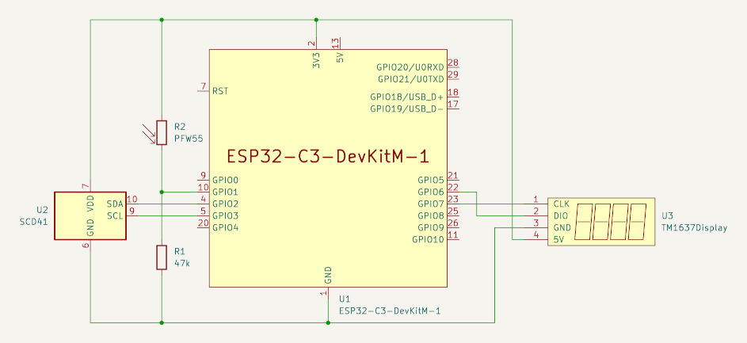

# Air monitor

This is an ESP32 based project to measure air quality in terms of CO2 concentration, temperature and humidity. It is especially useful in well-isolated houses without ventilation to indicate when you need to open the window to get some fresh air.

## Features

* Regularly measures CO2, temperature and humidity
* Visualizes air quality with the on-board 3 colour LED in a green yellow red scale
* Optionally publishes measurements to MQTT via WiFi
* Optionally publishes measurements via Bluetooth low energy (BLE) GATT


## Hardware

* [ESP32 C3 dev module](https://docs.espressif.com/projects/esp-idf/en/latest/esp32c3/hw-reference/esp32c3/user-guide-devkitm-1.html)
* A CO2 sensor, one of
    * [Sensirion SCD30 breakout board](https://wiki.seeedstudio.com/Grove-CO2_Temperature_Humidity_Sensor-SCD30/)
    * [Sensirion SCD41 breakout board](https://wiki.seeedstudio.com/Grove-CO2_&_Temperature_&_Humidity_Sensor-SCD41/)
    * [Winsen MH-Z19](https://www.winsen-sensor.com/product/mh-z19c.html)
* Optionally, a [Grove 4 digit display](https://wiki.seeedstudio.com/Grove-4-Digit_Display/)
* Optionally, an LDR PFW551M to measure ambient brightness and therewith control display brightness


## Wiring

The full-blown schematics is as follows:



As mentioned, several components are optional, e.g. the four-digit display or the brightness sensor. If you use an MH-Z19 CO2 sensor, it is connected via TX and RX and needs to be supplied by 5V.


# Software installation

## PlatformIO

* Select the features to use and the wiring in `platformio.ini`.
* If you use MQTT, fill in your WiFi, NTP (including time zone) and MQTT data in `mqtt-settings.h`.
* To compile and flash, run the command
```
pio run -t upload
```


## Arduino

* Install ESP32 board support in Arduino [as described in Espressif's documentation](https://docs.espressif.com/projects/arduino-esp32/en/latest/installing.html)
* Install the necessary libraries in Arduino:
    * [Sensirion SCD30 library](https://github.com/Sensirion/arduino-i2c-scd30) and its dependency [Sensirion Arduino Core Library](https://github.com/Sensirion/arduino-core), if you use this sensor
    * [Sensirion SCD4x library](https://github.com/Sensirion/arduino-i2c-scd4x) and its dependency [Sensirion Arduino Core Library](https://github.com/Sensirion/arduino-core), if you use this sensor
    * Jonathan Dempsey's [MH-Z19 library](https://github.com/WifWaf/MH-Z19), if you use this sensor
    * [Adafruit Neopixel library](https://github.com/adafruit/Adafruit_NeoPixel) to drive the (built-in) 3 colour LED
    * [TM1637 (LED Driver) libary](https://github.com/avishorp/TM1637) if you use a 4 digit 7-segment display
    * [Arduino MQTT client library](https://github.com/knolleary/PubSubClient) if you want to send data to MQTT or receive data from MQTT
    * [JSON library for Arduino](https://github.com/bblanchon/ArduinoJson) if you want to receive data from MQTT
* Select the features you want to use and the wiring in `feature_selection.h`.
* If you use MQTT, fill in your WiFi, NTP (including time zone) and MQTT data in `mqtt-settings.h`.
* Select the board ESP32 C3 Dev Module in Arduino
* Compile and flash.
